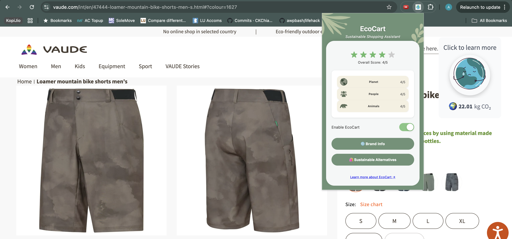

# 🌿 EcoCart: The greener way to shop!

*Submission for Lifehack 2025*

## Problem Statement

Challenge:
Design a sustainability shopping companion — a browser extension or mobile application — that provides users real-time information about the environmental sustainability of brands and products as they shop online. The app should offer alternative recommendations, detailed sustainability scores, and easy-to-understand visual indicators of environmental impact.

## Background


Consumers often unintentionally support unsustainable practices due to a lack of clear information about the environmental impacts of their purchases. According to a 2023 McKinsey report, 68% of consumers want to make sustainable choices but lack accessible and reliable information to do so.

## 🛠️ Our Solution: EcoCart


EcoCart is a browser extension designed to promote ethical and environmentally conscious shopping. By integrating real-time data from trusted sustainability sources and large language models, EcoCart empowers users with the knowledge they need to shop responsibly—right at the point of decision.

## 🔍 How EcoCart Answers the Challenge


Extension in action!

### Features
<div align="center">
    <table>
    <tr>
        <td align="center">
        
        <br/><sub>Overall brand score</sub>
        </td>
        <td align="center">
        
        <br/><sub>Carbon footprint calculator</sub>
        </td>
    </tr>
    </table>
</div>

- Real-Time Brand Sustainability Scores
    - EcoCart scrapes product brand names on shopping websites and cross-references them with publicly available data from Good On You, a trusted sustainability database. Users instantly see how a brand fares on environmental, labor, and animal welfare criteria.

- Carbon Footprint Estimation
    - Our extension estimates the carbon impact of products based on the typical manufacturing locations and supply chain assumptions derived from brand data and public sustainability reports.

<div align="center">
    <table>
    <tr>
        <td align="center">
        
        <br/><sub>Detailed explaination of metrics</sub>
        </td>
        <td align="center">
        
        <br/><sub>Sustainable recommendations</sub>
        </td>
    </tr>
    </table>
</div>

- Generative Summaries & Recommendations

    - EcoCart uses OpenAI’s GPT models to generate explanations of eco-friendly or harmful practices in the brand’s supply chain.

    - Suggestions of alternative products that score higher in sustainability, based on live web search and the user's current shopping interest.
- Simple and Actionable Visual Indicators
- Color-coded badges and tooltips make sustainability information understandable at a glance, encouraging responsible choices without cognitive overload.

## Tech stack


### Frontend:
A browser extension built with TypeScript, designed for compatibility with Chrome and Chromium-based browsers.

### Backend Logic:
Scrapes brand names and product titles using DOM selectors.
Matches scraped brand names against a cached dataset from Good On You.
Sends the product and brand metadata to an OpenAI-powered summarizer for contextual insights and actionable advice.

### Data Sources:
- Good On You
- Bing search results via Microsoft Search API (optional layer for alternative discovery)

  
## AI Integration:
We use the OpenAI API to generate contextual sustainability summaries and suggestions for each product dynamically, ensuring adaptability across websites, all while ensuring infomation is presented accurately and easy to understand.

# 🚀 Usage Instructions

Installation:
Clone or download this repository, then build the relevant files.
```
git clone https://github.com/awpbash/lifehack.git
cd lifehack
npm i
```

add your OpenAI API Key to the .env file as

*VITE_API_KEY="sk....."*
```
npm run build
```
Load the Extension (Chrome):
Open Chrome and go to chrome://extensions/.
Enable "Developer Mode".
Click "Load unpacked" and select the /extension directory.

# Browse & Learn:
Navigate to your favorite shopping websites.
EcoCart will overlay sustainability ratings, summaries, and recommendations on product pages.

# 🎥 Demo Video

👉 Watch our demo (10 min)

